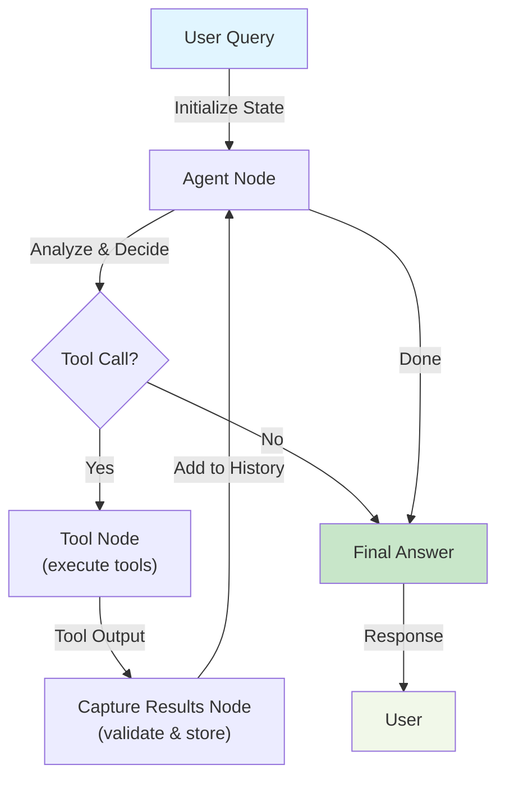

# Agentic CSV Analytics & Chat

A full-stack AI data analytics application that uploads CSV files, analyzes them with Pandas, and provides intelligent chat-driven insights using an LangGraph-powered agent workflow.

## Features

- **CSV Upload & Analysis** — Upload any CSV and get instant dataset statistics, quality scores, anomaly detection, and missing value analysis
- **Cached Results** — Analysis results are cached in PostgreSQL for fast repeated lookups
- **AI Agent Chat** — Ask natural language questions about your data; the AI agent decides which tools to use and provides structured insights
- **Dataset Visualization** — Generate charts and explore data trends interactively
- **PDF Report Generation** — Export analysis summaries as PDF reports
- **Tool-Based Workflow** — Uses LangGraph to orchestrate multi-step agent reasoning and tool execution

## Tech Stack

### Backend
- **Framework**: FastAPI
- **Data Processing**: Pandas, NumPy
- **AI/Agents**: LangGraph, LangChain, Ollama/ChatOllama
- **Database**: PostgreSQL + SQLAlchemy ORM
- **Reports**: ReportLab (PDF generation)

### Frontend
- **Framework**: React with Vite
- **Styling**: CSS

### Infrastructure
- **Database**: PostgreSQL 15 (Docker Compose)
- **API Server**: Uvicorn
- **Development**: Python 3.9+

## Project Structure

```
backend/
  app/
    main.py                 # FastAPI entry point
    api/
      routes.py             # API endpoints (upload, chat, visualization, PDF)
    services/
      data_analyzer.py      # CSV analysis engine
    agents/
      workflow.py           # LangGraph agent workflow
      state.py              # Agent state schema
      tools.py              # Tool implementations (summarize, chart, anomalies, etc.)
      validation.py         # Tool output validation
    database/
      connection.py         # SQLAlchemy setup and dependencies
    models/
      dataset.py            # Database model for dataset reports
  requirements.txt          # Python dependencies
  docker-compose.yml        # PostgreSQL service config
  CLAUDE.md                 # Detailed handoff notes for Claude Code

frontend/
  src/
    App.jsx                 # Main React app
    main.jsx                # React entry point
  package.json              # Frontend dependencies
  vite.config.js            # Vite configuration
```

## Quick Start

### Prerequisites
- Python 3.9+
- Node.js 16+
- Docker (for PostgreSQL)

### Backend Setup

1. **Start the database:**
   ```bash
   docker-compose up -d
   ```

2. **Install Python dependencies:**
   ```bash
   pip install -r requirements.txt
   ```

3. **Run the backend:**
   ```bash
   uvicorn app.main:app --reload --host 0.0.0.0 --port 8000
   ```

   The API will be available at `http://localhost:8000` and docs at `http://localhost:8000/docs`

### Frontend Setup

1. **Navigate to frontend directory:**
   ```bash
   cd frontend
   ```

2. **Install dependencies:**
   ```bash
   npm install
   ```

3. **Run development server:**
   ```bash
   npm run dev
   ```

   The app will be available at `http://localhost:5173`

## API Endpoints

- `POST /api/upload` — Upload and analyze a CSV file
- `GET /api/dataset/cache?filename=<name>` — Retrieve cached analysis
- `POST /api/chat` — Send a natural language query to the agent
- `GET /api/dataset/visualize` — Get chart-ready data for visualization
- `GET /api/report/pdf` — Generate a PDF report

See `http://localhost:8000/docs` for the full OpenAPI specification.

## Testing

Run backend tests:
```bash
pytest tests
```

## Agent Workflow

The AI agent follows this cycle:



**Workflow Stages:**

1. **User Query** — Receive natural language question and dataset context
2. **Agent Node** — AI analyzes state and decides next action
3. **Decision** — Does the agent need to call a tool or answer directly?
4. **Tool Node** — Execute selected tools (summarize, chart, detect anomalies, save report)
5. **Capture Results** — Validate tool output and store in state history
6. **Loop** — Agent sees captured results and decides to continue or answer
7. **Final Answer** — Return structured response to user

The workflow is defined in `app/agents/workflow.py` and uses LangGraph for state management and conditional routing.

## Development Notes

- Agent state is preserved across turns to enable multi-step reasoning
- Tool outputs are validated before being stored in state
- All tool results follow a structured JSON schema for reliability
- The backend uses Ollama/ChatOllama for local LLM inference

## License

MIT

## Contributing

Contributions are welcome! Please read the code and `CLAUDE.md` for architecture details before submitting PRs.
